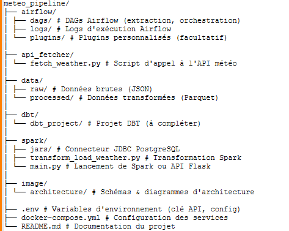
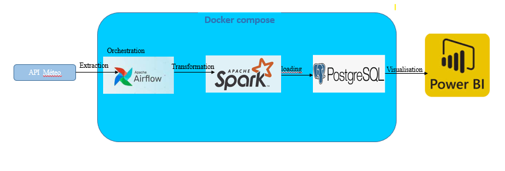

# 🌦️ Projet Pipeline de Données Météo et Visualisation

## 📌 Contexte & Objectif

Ce projet a pour but de construire un pipeline de données automatisé pour :

- Collecter quotidiennement les données météo de 12 pays via une API publique.
- Stocker ces données au format brut (`JSON`) puis transformé (`Parquet`).
- Charger les données transformées dans une base PostgreSQL.
- Visualiser les données dans un outil BI (Power BI).

---

## 🛠️ Stack Technique

| Composant       | Rôle                                              |
|-----------------|---------------------------------------------------|
| **Python**      | Scripts d’extraction depuis l’API                 |
| **Apache Airflow** | Orchestration des tâches                        |
| **Apache Spark** | Transformation et nettoyage des données          |
| **PostgreSQL**  | Stockage des données structurées                  |
| **Docker Compose** | Conteneurisation et orchestration des services |
| **Power BI**    | Analyse et visualisation des données              |

---

## 📐 Architecture & Outils Utilisés

---

## 🔄 Pipeline de Traitement

**Extraction**  
- Script Python (`fetch_weather.py`) appelle l’API météo avec 12 pays ciblés.  
- Les fichiers JSON sont stockés dans `data/raw/`.

**Transformation**  
- Spark transforme les données : nettoyage, typage, mise au format.  
- Sauvegarde en fichiers `Parquet` dans `data/processed/`.

**Chargement**  
- Spark charge les données dans une base PostgreSQL via JDBC.

**Orchestration**  
- Airflow automatise le pipeline avec un DAG : extraction → transformation → chargement.

**Visualisation (à venir)**  
- Connexion Power BI à la base PostgreSQL pour créer des dashboards météo.

---

## ✅ Ce qui fonctionne

- ✅ Extraction automatisée via Airflow.  
- ✅ Stockage des fichiers bruts (JSON).  
- ✅ Transformation des données avec Spark.  
- ✅ Chargement dans PostgreSQL.  
- ✅ Pipeline Dockerisé & modulaire.

---

## 📈 Prochaines étapes

- 🔍 Intégration de Power BI pour la visualisation des données météo.  
- 🧩 Mise en place de tests unitaires pour les scripts Spark et Python.  
- 📊 Ajout de statistiques exploratoires dans PostgreSQL.  
- 📈 Suivi d'exécution (monitoring) du pipeline.

---

## 📷 Diagramme d'architecture

